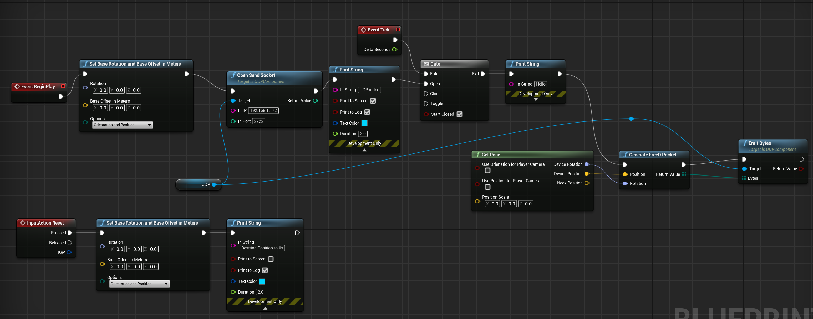

# ue4-free-d-generator
#### Adds a blueprint function to generate a FreeD packet from position and rotation data.
Can be used in conjunction with the ue4 oculus quest libraries to generate FreeD from its tracking data.

## Sample ue4 integration:
This uses the [UDP wrapper plugin](https://github.com/getnamo/UDP-Unreal) and the oculus quest blueprints to output FreeD from a quest 2.

## Sample Use Case:

